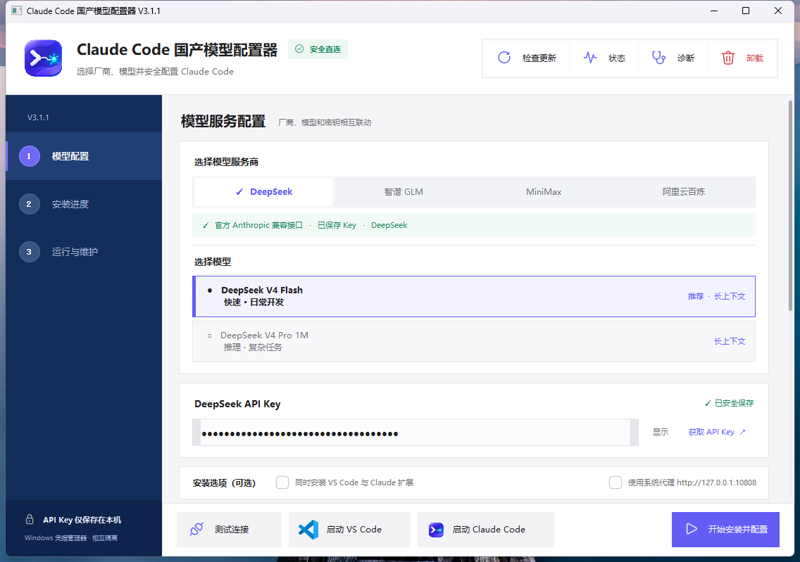
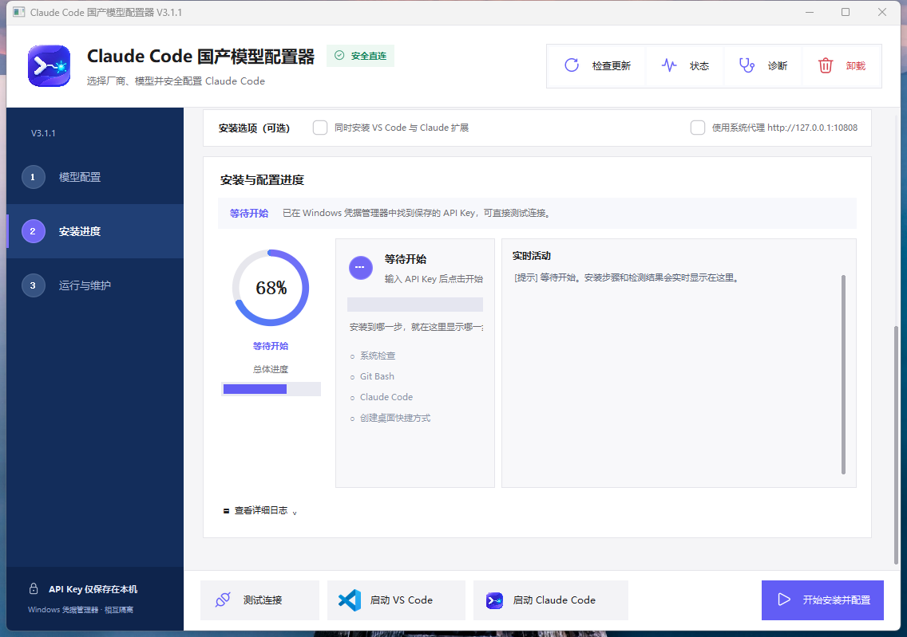

# Claude Code 国产模型配置器 V3.1.1

这是从 V2.9.6 稳定版演进而来的多模型版本。它面向 Windows 10/11 x64：客户选择模型厂商和模型，输入自己的 API Key，配置器自动准备 Claude Code 所需组件，并通过厂商官方提供的 Anthropic 兼容接口直连。

> 当前版本：**V3.1.1**　|　[查看完整更新记录](CHANGELOG.md)　|　[下载 V3.1.1](https://github.com/744219288/Claude-Code-DeepSeek-Configurator/releases/tag/v3.1.1)

## 实际界面

下面两张图片来自 V3.1.1 程序实际运行截图，不是概念效果图。

### 模型服务配置



### 安装与配置进度



## V3.1.1 界面

- 采用简洁、克制、接近 Apple 系统设置的视觉语言，重新统一背景、灰阶、留白、字重、圆角和控件层级。
- 固定顶部命令栏完整保留检查更新、状态、诊断和卸载，没有删除原有功能。
- 固定底部操作栏完整保留测试连接、启动 VS Code、启动 Claude Code 和开始安装并配置。
- 右侧配置与进度区域支持可见滚动条和鼠标滚轮，小窗口无需全屏也能查看全部信息。
- 服务商改为紧凑分段选择；阿里云百炼继续区分 Coding Plan、Token Plan 和按量付费。
- 模型改为带用途和上下文标签的列表选择，不再使用旧式下拉框。
- 安装进度同时显示总体进度、当前步骤、实时活动与可展开日志。
- 图标系统升级为微软 Fluent System Icons，VS Code 启动入口使用其官方品牌资源。
- 配置器左上角和“启动 Claude Code”继续使用项目原有紫蓝色正式图标。
- 圆环进度改用抗锯齿光栅渲染，带渐变进度、柔和轨道和圆润端点。
- 本次只精修界面与视觉资源，没有修改安装、模型配置、凭据、更新和卸载业务逻辑。

更详细的设计调整见 [V3.1.1 界面精修报告](V3.1.1界面精修报告.md)。

## 当前支持

| 界面选项 | 接口用途 | 可选模型 |
|---|---|---|
| DeepSeek | DeepSeek 官方 Anthropic 兼容接口 | DeepSeek V4 Flash、DeepSeek V4 Pro 1M |
| 智谱 GLM | 智谱官方 Claude Code 接口 | GLM-4.7、GLM-5.2 1M |
| MiniMax | MiniMax 官方 Claude Code 接口 | MiniMax M3 1M |
| 阿里云百炼 · Coding Plan | Coding Plan 专用入口 | Qwen3.7 Plus |
| 阿里云百炼 · Token Plan | Token Plan 专用入口 | Qwen3.8 Max、Qwen3.6 Flash |
| 阿里云百炼 · 按量付费 | 百炼普通按量入口 | Qwen3.7 Max |

阿里云的三种选项必须分开，因为它们的 API Key 类型和接口地址不同。客户应按自己实际购买的套餐选择，不能混用。

## 工作方式

1. 选择厂商后，界面只展示该厂商允许的模型。
2. 每个厂商的 API Key 单独保存在 Windows 凭据管理器中。
3. 配置器不把 Key 写入配置文件、状态文件、日志或诊断包。
4. 启动 Claude Code 或 VS Code 时，只把当前厂商的接口、模型和 Key 注入子进程。
5. 切换厂商时复用已经安装的 Claude Code、Git 和 Node.js，无需重复安装整套环境。
6. 连接测试直接请求所选厂商的 `/v1/messages`，不会只做“端口通了”的假检测。

## 为什么采用注册表式设计

厂商配置集中在 `installer/providers.py`。每个条目明确写出接口地址、Key 名称、支持模型、角色模型映射和上下文参数。新增厂商不需要复制安装流程，也不会让界面、测试和启动逻辑各自维护一份容易失真的名单。

只有官方明确提供 Anthropic/Claude Code 兼容接口的厂商才适合直接加入。若某家只提供 OpenAI 兼容接口，需要协议转换层，应单独设计，不能伪装成直连。

## 开发与验证

```powershell
$env:CLAUDE_DEEPSEEK_OFFLINE_ROOT = (Resolve-Path '.\offline').Path
python -m unittest discover -s tests -v
```

当前共 **108 项自动化测试**，覆盖旧版安装、卸载、离线资源、安全凭据、直连环境，以及新增的厂商隔离、模型校验、真实请求构造和 V3.1.1 界面资源检查。打包后的 EXE 也已通过完整 GUI 自检。

## 测试版说明

V3.1.1 当前提供的是未签名测试包，Windows SmartScreen 可能显示未知发布者。请从本仓库 Releases 下载完整 ZIP，完整解压后再运行，不要脱离同级 `offline/` 目录单独复制 EXE。

## 官方接入文档

- DeepSeek：https://api-docs.deepseek.com/zh-cn/quick_start/agent_integrations/claude_code/
- 智谱：https://docs.bigmodel.cn/cn/guide/develop/claude
- MiniMax：https://platform.minimaxi.com/docs/token-plan/claude-code
- 阿里云百炼：https://help.aliyun.com/zh/model-studio/claude-code

本项目是第三方社区工具，不隶属于或代表 Anthropic、DeepSeek、智谱、MiniMax、阿里云、Microsoft、Node.js 或 Git for Windows。
