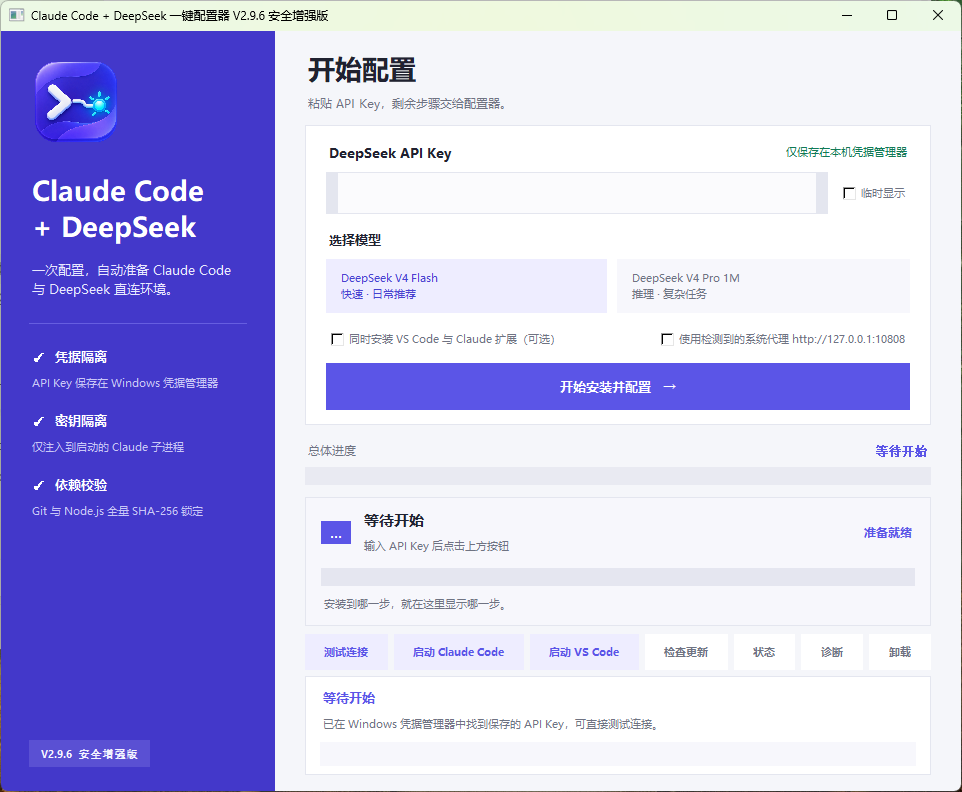

# Claude Code + DeepSeek 一键配置器

> 面向**全新 Windows 10 / 11 x64 电脑**的一键安装器。电脑不需要预装 Python、Node.js、npm、Git、Claude Code 或 VS Code；用户只需输入 DeepSeek API Key，配置器会自动准备必要组件、安装 Claude Code、验证 API，并创建桌面与终端入口。

当前版本 **V2.9.6**（最新提交见 [CHANGELOG](CHANGELOG.md)）。本仓库主分支 `main` 始终指向最新稳定源码；二进制发布物（EXE + 离线资源）以 [GitHub Release](https://github.com/744219288/Claude-Code-DeepSeek-Configurator/releases) 形式分发。

## 效果预览

> V2.9.6 主界面：输入 API Key → 选择模型 → 一键安装并验证 → 启动 Claude Code



## 它能做什么

- **零前置依赖**：裸 Windows 机器也能跑。不需要用户自己去装 Python / Node / Git / npm，全部由配置器内置并隔离管理。
- **直连 DeepSeek**：直接对接 DeepSeek 官方 **Anthropic 兼容接口** `https://api.deepseek.com/anthropic`，无需本地代理、无需 Python / LiteLLM。
- **稳定入口**：安装完成后生成桌面图标与一个 `claude` 终端命令，关闭配置器、重开终端后依然可用。
- **可诊断失败**：每个安装环节都有明确的可读错误与上下文，不会「卡住没反应」。

## 核心特性

| 特性 | 说明 |
|------|------|
| 直连 Anthropic 接口 | 使用 `https://api.deepseek.com/anthropic`，无本地代理进程、无 Python 链路 |
| 内置隔离运行时 | 内置并校验 **PortableGit 2.55.0.5** 与 **Node.js 22.23.2**，隔离于配置器目录，不污染系统 |
| 固定版本安装 | npm 安装前先确认 Claude Code 主包与 `win32-x64` 平台包存在**完全相同版本**，规避 `@latest` 竞态 |
| 原子离线安装 | 首跑校验整个 `offline` 清单，原子复制到 `%LOCALAPPDATA%\Programs\ClaudeDeepSeekConfigurator`，复制后逐文件复核 |
| 凭据隔离 | API Key 仅存于当前用户 **Windows 凭据管理器**，仅启动子进程时注入，不写入状态文件或永久环境变量 |
| 真实连接测试 | 安装末尾调用 DeepSeek API 做真实请求，成功后才创建稳定入口 |
| 98 项自动化测试 | 覆盖安装核心、凭据、GUI、V2.9.3 回归，CI 友好 |
| 物料清单 | 附带 CycloneDX `SBOM.cdx.json`，可审计依赖与许可证 |

## V2.9.6 相对旧版的架构转向

| 维度 | 旧版（V2.7 – V2.9.2） | V2.9.6 |
|------|------|------|
| 接入方式 | LiteLLM + 本地代理 `127.0.0.1:4000` | **直连 DeepSeek 官方 Anthropic 接口** |
| 依赖 | 需要 Python / venv / LiteLLM | **彻底移除 Python 链路** |
| 模型 | `deepseek-chat` / `deepseek-reasoner` | `deepseek-v4-flash`、`deepseek-v4-pro[1m]` |
| 凭据 | 明文 / 环境变量风险 | **只存 Windows 凭据管理器**，仅启动子进程时注入 |
| 离线资源 | ZIP / 临时目录易丢失 | **稳定副本 + 原子复制 + 逐文件校验** |
| 安装源 | 直接 `@latest` | **WinGet / 官方优先，npm 回退校验同版本** |

> 这套「去 Python 代理、直连 Anthropic 兼容端点、凭据隔离」的设计，是此类工具近期的主流正确方向，思路干净且更安全。

## 安全与凭据模型

| 环节 | 行为 |
|------|------|
| 存储 | API Key 写入当前用户的 **Windows 凭据管理器**（DPAPI 加密），不落明文文件 |
| 注入 | 仅在启动 Claude Code / VS Code 子进程时以环境变量形式注入，**进程退出即失效** |
| 清理 | 卸载 / 重置时通过 `Advapi32` 凭据 API 删除；删除采用 `use_last_error=True`，仅 `ERROR_NOT_FOUND (1168)` 视为幂等成功 |
| 残留 | V2.7–V2.9.2 遗留的本地代理环境变量会在安装中被显式清理 |
| 签名 | 正式发布必须使用受信任代码签名证书（`sign_build.ps1`）；未签名测试包可能触发 SmartScreen |

## 发送与使用

1. 发送**整个 V2.9.6 ZIP**，不要只发 EXE（EXE 依赖同级 `offline/` 资源）。
2. 在新电脑上把 ZIP 保存到本地磁盘，右键 **「全部解压」**。
3. 从解压后的目录运行 `Claude-Code-DeepSeek-一键配置器.exe`，**不要**在微信预览或压缩包预览里直接双击运行。
4. 输入 DeepSeek API Key，选择模型（`deepseek-v4-flash` / `deepseek-v4-pro[1m]`），点击 **「开始安装并配置」**。
5. 成功后点击 **「启动 Claude Code」**，或关闭旧终端、打开新终端后输入 `claude`。

> 若 ZIP 没有完整解压、`offline/` 缺失或文件被修改，程序会在执行任何内置组件前中止，并明确显示 EXE 目录、预期资源目录与具体校验失败项。

## 安装顺序

1. 检查 Windows 版本、x64 架构、写入权限与磁盘空间。
2. 校验 `offline/manifest.json` 中的全部文件，并安装固定资源副本。
3. 把 API Key 保存到 Windows 凭据管理器。
4. 发现已有 Git Bash；没有时解压内置 PortableGit。
5. 探测 WinGet、Anthropic 官方源、npm 国内镜像与 npm 官方源。
6. 优先使用原子发布的 WinGet / 官方安装器；失败时使用隔离 Node/npm 回退。
7. npm 回退先验证主包与 Windows x64 平台包版本同步，再固定版本安装并运行 `claude --version`。
8. 可选安装 VS Code 与 Anthropic 扩展。
9. 清理 V2.7–V2.9.2 遗留的本地代理环境变量，配置子进程级 DeepSeek 直连。
10. 调用 DeepSeek API 做真实连接测试，成功后创建稳定入口（桌面 + 终端 `claude`）。

## 目录结构

```
Claude-Code-DeepSeek-Configurator/
├── main.py                      # 入口
├── build.ps1                    # 构建 EXE（需 Python 3.12）
├── build_offline_assets.ps1     # 下载并校验离线组件（Git / Node）
├── package_unsigned_test.ps1    # 打包未签名测试包
├── package_v2.ps1               # 打包发布物
├── sign_build.ps1               # 受信任代码签名（正式发布用）
├── CHANGELOG.md                 # 版本历史（最新在前）
├── SBOM.cdx.json                # CycloneDX 软件物料清单
├── LICENSE                      # MIT
├── installer/
│   ├── __init__.py
│   ├── core.py                  # 安装主流程：版本/镜像探测、回退逻辑
│   ├── credentials.py           # Windows 凭据管理器封装
│   └── gui.py                   # Tkinter 界面
├── hooks/                       # PyInstaller tkinter 打包钩子
│   ├── hook-tkinter.py
│   ├── runtime_tkinter.py
│   └── pre_find_module_path/hook-tkinter.py
├── tests/                       # 98 项自动化测试
│   ├── test_core.py
│   ├── test_credentials.py
│   ├── test_gui.py
│   └── test_v293.py
├── tools/
│   ├── clean_machine_smoke.py
│   ├── refresh_offline_metadata.ps1
│   └── refresh_offline_metadata.py
├── assets/
│   ├── app_icon.ico
│   ├── app_icon.png
│   └── screenshot-v2.9.6.png    # 主界面截图（见上「效果预览」）
└── offline/                     # 离线内置组件 + manifest 校验清单
    ├── manifest.json
    ├── git/PortableGit-2.55.0.5-64-bit.7z.exe
    └── node/node-v22.23.2-win-x64.zip
```

## 构建与测试

构建机需要 **Python 3.12**，仅用于把源码打成 EXE；目标新电脑运行 EXE **不需要 Python**。

```powershell
$env:CLAUDE_DEEPSEEK_BUILD_PYTHON312 = 'C:\Path\To\python.exe'

# 1) 拉取并校验离线组件（Node 官方 SHA-256、GitHub 资产 SHA-256、PortableGit 发布者）
.\build_offline_assets.ps1

# 2) 构建 EXE
.\build.ps1

# 3) 运行 98 项自动化测试
python -m unittest discover -s tests

# 4) 打包未签名测试包（仅用于内部验证，会触发 SmartScreen）
.\package_unsigned_test.ps1
```

`build_offline_assets.ps1` 从 Node.js 官方发行页与 Git for Windows 官方 GitHub Release 下载固定组件，校验 Node 官方 SHA-256、GitHub 资产 SHA-256 与 PortableGit Authenticode 发布者，并重新生成 manifest 与 CycloneDX SBOM。

> ⚠️ 正式发布**必须**使用受信任代码签名证书运行 `sign_build.ps1`；未签名测试包可能触发 SmartScreen，这是测试包属性，不应通过关闭 Windows 安全功能来规避。

## 已执行验证

- 98 项自动化测试通过。
- 内置 PortableGit 实际解压，`git --version` 与 `bash.exe` 验证通过。
- 内置 Node.js 实际解压：Node v22.23.2、npm 10.9.8 验证通过。
- 受管理 npm 通过国内镜像查询到主包 / Windows 平台包共同版本并实际安装，`claude --version` 通过。
- 离线 manifest 当前锁定 PortableGit、Node ZIP 与 Node 官方 SHA 清单。

## 限制与故障排查

真正宣称「任何正常电脑都绝不出问题」是不负责任的：企业应用控制、杀毒误报、断网、服务端故障或 DeepSeek 账户状态仍可能阻止安装。V2.9.6 已消除以下**已知**问题，并对每个剩余失败点提供可诊断错误：

| 现象 | 原因 / 处理 |
|------|------|
| 「删除凭据失败，错误码 0」 | 旧版凭据 API 误报；V2.9.6 改用 `use_last_error=True`，仅 `ERROR_NOT_FOUND` 视为成功 |
| 找不到受管理 Node.js | 旧版稳定副本缺 `offline` 资源；V2.9.6 改为原子复制 + 逐文件复核 |
| 微信/压缩包里双击 EXE 报错 | 资源路径依赖工作目录；务必先完整解压到本地目录再运行 |
| 运行 EXE 弹 SmartScreen | 未签名测试包的正常表现；正式发布请走 `sign_build.ps1` 签名 |
| 安装卡在 npm | 多为平台包发布竞态；V2.9.6 已切换为同版本校验后固定安装 |

## 免责声明

本项目是**第三方社区工具**，不隶属于或代表 Anthropic、DeepSeek、Microsoft、Node.js 或 Git for Windows。使用即表示你理解：自动安装会修改本机环境、写入 Windows 凭据、创建程序目录与入口；请在可信电脑上运行，并通过官方渠道获取 DeepSeek API Key。

## 许可

[MIT](LICENSE)
